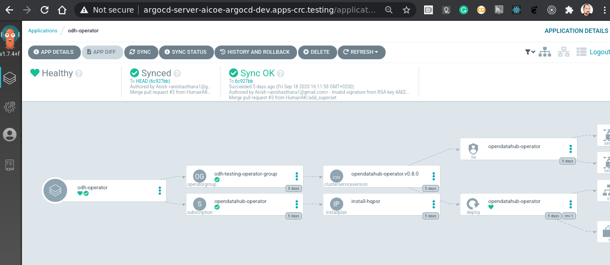
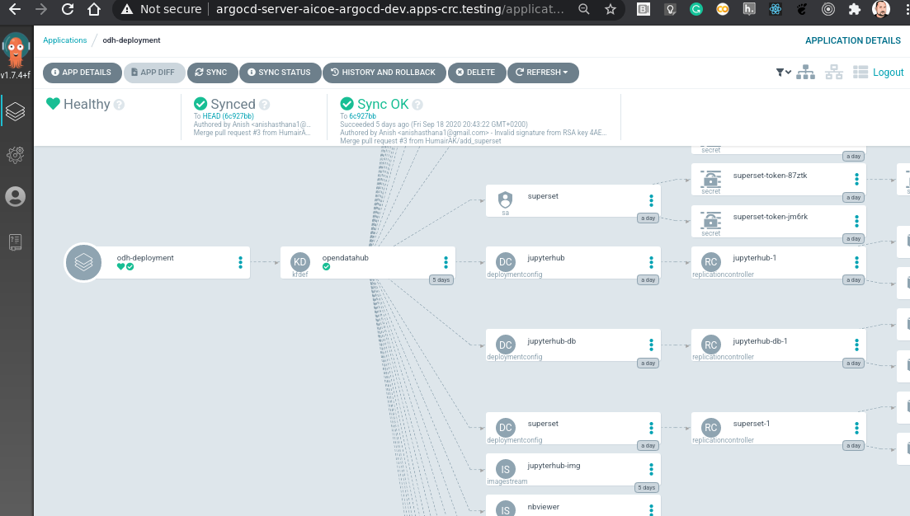

# Installing ODH using ArgoCD

## Preparation

First make sure that you have the OpenDataHub operator available in your OpenShift.

```bash
oc get packagemanifests -n openshift-marketplace | grep opendatahub-operator
```

If it's not present, then you need to troubleshoot the marketplace: https://github.com/operator-framework/operator-marketplace/issues/344


Then we need to create a projects named `odh-operator` and `odh-deployment`. (The name of the project is hard-coded in the `kustomize` files in https://github.com/anishasthana/my-odh-install and you can change is there using `kustomize`.)

```bash
oc new-project odh-operator
oc new-project odh-deployment
```

Our ArgoCD SA `argocd-manager` needs to have access to the new project. On CRC I suggest giving `argocd-manager` access to all projects by creating a ClusterRoleBinding to a ClusterRole.

`oc apply -f examples/argocd-cluster-binding.yaml`

Then you need to change the `dev-cluster` to include all projects/namespace. (This is done by actually removing the value of `namespace`).

```bash
oc patch secret dev-cluster-spec -n aicoe-argocd-dev --type='json' -p="[{'op': 'add', 'path': '/data/namespace', 'value':''}]"
```

Be aware that if you change this value in the ArgoCD UI, you might loose the stored credentials for the cluster due to a bug in ArgoCD.

## Creating the ArgoCD applications

Now we can proceed with creating the ArgoCD Applications. We will create 2 applications:

  1. The ODH operator. (Installs the ODH operator itself `odh-operator`.)
  1. The ODH deployment. (Installs ODH components into `odh-deployment`.)

### Creating the ODH opetaror

Go to https://argocd-server-aicoe-argocd-dev.apps-crc.testing/applications and click "New App". Enter these values:

| Field            | Value                                                |
|------------------|------------------------------------------------------|
| Project:         | Default                                              |
| Cluster:         | dev-cluster (https://api.crc.testing.6443)           |
| Namespace:       | odh-operator                                         |
| Repo URL:        | https://github.com/anishasthana/my-odh-install.git   |
| Target revision: | HEAD                                                 |
| Path:            | odh-operator/base                                    |

This creates an app from definition in the repo under the path `odh-operator/base` and deploys it to the `odh-operator` namespace on the `dev-cluster`. Please note that the namespace is also hard-coded in the repo so changing it requires changing files in the repo.


Create the app and you will see Argo deploying resources:


### Creating the ODH deployment

Again go to https://argocd-server-aicoe-argocd-dev.apps-crc.testing/applications, click "New App" and enter these values:

| Field            | Value                                               |
|------------------|-----------------------------------------------------|
|Project:         | Default                                              |
|Cluster:         | dev-cluster (https://api.crc.testing.6443)           |
|Namespace:       | odh-deployment                                       |
|Repo URL:        | https://github.com/anishasthana/my-odh-install.git   |
|Target revision: | HEAD                                                 |
|Path:            | odh-operator-kfdef                                   |

Based on the content of .... you will see components of ODH being created similar to:



You can find routes for your new ODH instance by running:
```bash
$ oc get routes -n odh-deployment
NAME         HOST/PORT                                    PATH   SERVICES     PORT       TERMINATION     WILDCARD
jupyterhub   jupyterhub-odh-deployment.apps-crc.testing          jupyterhub   8080-tcp   edge/Redirect   None
superset     superset-odh-deployment.apps-crc.testing            superset     8088-tcp                   None
```
